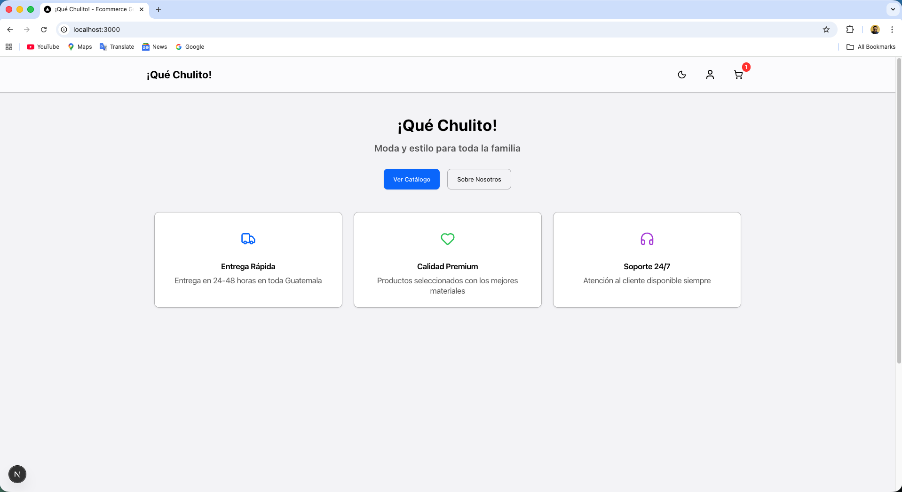
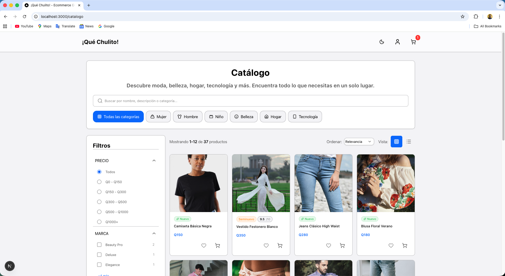
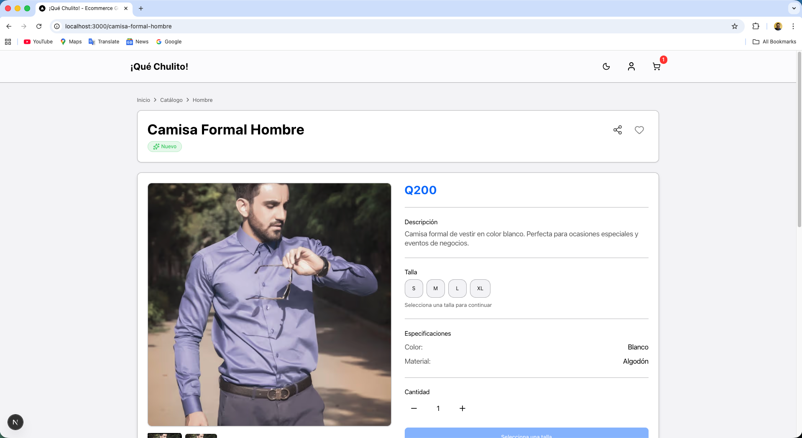
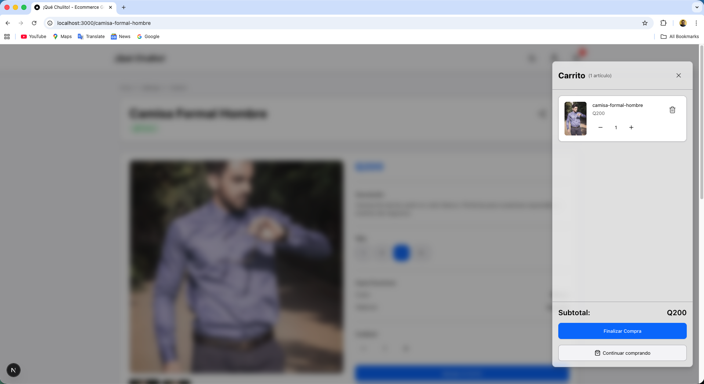
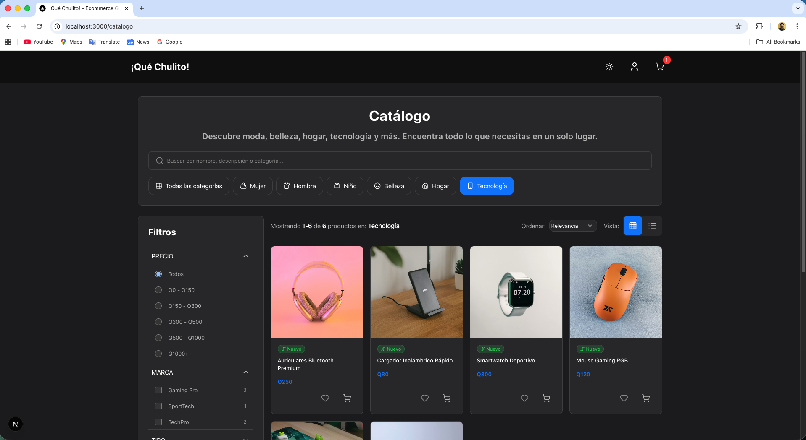

# ¡Qué Chulito! - Ecommerce Guatemala

Ecommerce moderno para Guatemala con diseño Liquid Glass, mobile-first y arquitectura SOLID.

> ⚠️ **NOTA IMPORTANTE**: Este proyecto se encuentra actualmente **en desarrollo**. Las funcionalidades mostradas están en fase de construcción y pueden estar sujetas a cambios. No se recomienda su uso en producción hasta que se complete el desarrollo.

## 📸 Vista Previa

### Página Principal


### Catálogo de Productos


### Detalle de Producto


### Carrito de Compras


### Modo Oscuro


## 🚀 Tecnologías

- **Next.js 16** (App Router, React 19, TypeScript)
- **TailwindCSS v4** (Design Tokens, modo oscuro)
- **Redux Toolkit** + RTK Query + redux-persist
- **Firebase** (Hosting, Functions, Firestore, Auth)
- **next-themes** (tema claro/oscuro)
- **zod** (validación)

## 📦 Instalación

```bash
npm install
```

## ⚙️ Configuración

1. Copia `.env.local.example` a `.env.local`
2. Configura tus credenciales de Firebase
3. Ejecuta el seed de datos iniciales:

```bash
npm run seed
```

## 🏃 Desarrollo

```bash
npm run dev
```

Abre [http://localhost:3000](http://localhost:3000)

## 🏗️ Build

```bash
npm run build
npm start
```

## 🚀 Deploy a Firebase

```bash
firebase login
firebase init
firebase deploy
```

## 📱 Características

- ✅ Diseño Liquid Glass mobile-first
- ✅ Arquitectura SOLID + Patrones de Diseño
- ✅ Firestore optimizado multi-categoría
- ✅ Checkout vía WhatsApp
- ✅ Modo oscuro automático
- ✅ Accesibilidad WCAG básica
- ✅ SEO optimizado

## 🏗️ Arquitectura

```
src/
├── app/              # Pages (App Router)
├── components/       # UI Liquid Glass
├── store/           # Redux Toolkit
├── lib/
│   ├── firebase/    # Client + Admin SDK
│   ├── domain/      # Entities, Repositories, Services
│   ├── infrastructure/ # Firestore implementations
│   ├── services/    # OrderService, WhatsAppFactory
│   └── utils/       # Helpers
├── scripts/         # Seed scripts
└── seeds/           # Data seeds
```

## 🧪 Testing

```bash
npm run lint
```

## 📷 Cómo Agregar Imágenes al README

Para mostrar capturas de pantalla de tu proyecto en el README:

1. **Toma capturas de pantalla** de las siguientes vistas:
   - Página principal (`/`)
   - Catálogo de productos (`/catalogo`)
   - Detalle de producto (`/[slug]`)
   - Carrito de compras (sidebar)
   - Modo oscuro (toggle del tema)

2. **Guarda las imágenes** en la carpeta `docs/images/` con estos nombres:
   - `homepage.png` - Página principal
   - `catalog.png` - Catálogo
   - `product-detail.png` - Detalle de producto
   - `cart.png` - Carrito
   - `dark-mode.png` - Modo oscuro

3. **Formato recomendado**:
   - Formato: PNG o JPG
   - Tamaño: 1200px de ancho (para mejor visualización)
   - Puedes usar herramientas como [Lightshot](https://app.prntscr.com/) o la herramienta de captura de tu sistema

4. **Las imágenes ya están referenciadas** en el README, solo necesitas agregar los archivos.

### Ejemplo de captura de pantalla

Puedes usar herramientas como:
- **macOS**: `Cmd + Shift + 4` para captura de área
- **Windows**: `Win + Shift + S` para captura de área
- **Navegador**: DevTools → Toggle device toolbar → Capturar

## 📄 Licencia

MIT
